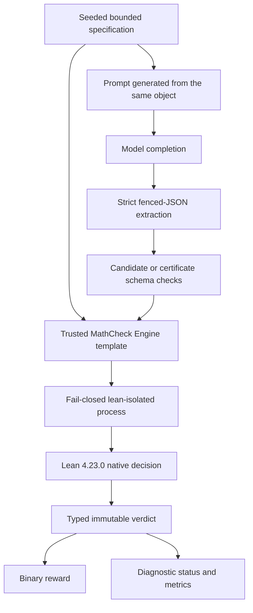

# How MathCheck RL Replaces Hidden Answer Keys with Lean-Checked Rewards

> Inside an answer-key-free math RL environment that turns complete bounded
> specifications into generated Lean checks, evaluates them with
> `native_decide`, and asks models for answers or certificates—not proof
> scripts.

Reinforcement learning needs a reward. Mathematics seems unusually well suited
to this requirement: answers are often short, exact, and easy to compare. Put a
number in a dataset, ask a model to solve the problem, and return 1 when the
strings agree.

That works until the answer is written as `33.0`, the problem admits several
equivalent forms, or the task asks for a structured object rather than a scalar.
It becomes more fragile when the reference program encodes the wrong boundary,
when a hidden test suite covers only familiar cases, or when the verifier times
out and the training system records “wrong answer.” Most importantly, the
answer key says what output was expected but often hides the contract that made
that output correct.

MathCheck RL explores a different arrangement for a deliberately bounded slice
of mathematics. Each task stores a complete machine-readable specification: a
finite domain and the expression, predicate, objective, or relation to evaluate
over it. The model sees a human-readable prompt derived from that specification
and submits only an integer candidate or a complete finite certificate. The
environment sends both objects to MathCheck Engine, which generates the Lean
checker and returns a typed verdict.

The companion article,
[Building a Lean-Backed Verifier for Bounded Mathematical Answers](https://github.com/stanleyngugi/mathcheck-engine/blob/main/TECHNICAL_ARTICLE.md),
develops the verifier and trust boundary in detail. This article concentrates
on the task, reward, evaluation, and distribution layers built on top of it.

There is no expected candidate stored in the primary task contract.

This does not make the environment ground-truth-free. The specification is the
ground truth. It also does not make the system a universal math verifier. The
current families are exact integer evaluation, bounded sums, bounded counts,
bounded minima, and complete relations over bounded integer pairs. The point is
to make the reward's meaning unusually clear inside that surface.

## Why a correct reward can still be a bad scientific instrument

A mathematical reward function has at least four jobs.

First, it has to recognize acceptable outputs without rewarding malformed or
ambiguous ones. If the task requires one JSON object, silently extracting the
first number from a paragraph creates an undocumented language around the
official language.

Second, it has to check the right proposition. Testing that every submitted
pair satisfies a condition does not establish that the model listed every
satisfying pair. Testing a proposed minimum for feasibility does not establish
minimality. Running a sequence program on ten indices does not prove its value
at the eleventh, much less for every natural number.

Third, it has to fail safely. A missing compiler, a sandbox configuration error,
and a mathematically false claim may all deserve zero reward during training,
but they are not the same event. Conflating them corrupts evaluation labels and
makes operational regressions look like changes in model ability.

Fourth, it has to behave consistently under the framework's concurrency model.
A reward and a diagnostic metric may be computed at the same time. If both
launch an expensive native check, one rollout is compiled twice. If they race
through mutable state, they may even record different timings or failure modes.

These are not exotic formal-methods concerns. They are ordinary measurement
concerns. A reward is part of the experiment, and an experiment is only as
interpretable as the instrument producing its labels.

## What answer-key-free means here

The phrase is easy to overstate, so it is worth defining precisely.

For a scalar MathCheck RL task, the environment stores a `ProblemSpec` like:

```json
{
  "kind": "count",
  "expression": "x%7 == 2 and x%5 != 0",
  "start": 3,
  "stop": 71
}
```

It does not store a field saying that the answer is, for example, 9. When the
model submits a candidate, the verifier combines that candidate with the frozen
specification and checks the full finite computation.

For a pair task, the environment stores a predicate and two bounded axes. It
does not store the expected pair list. The model must submit the complete
relation and its count. Lean constructs the relation from the specification and
checks exact equality.

So “answer-key-free” means:

- no expected candidate is stored or compared at reward time;
- the environment does store and trust a complete bounded checker
  specification;
- the candidate cannot replace or weaken that specification;
- reward is computed against the whole declared finite contract;
- success says nothing beyond the encoded bounds;
- specification authorship and prose-to-specification fidelity remain trusted
  upstream steps.

The older Verifiers compatibility interface requires a dataset column named
`answer`. In MathCheck RL that column contains serialized checker specification
data because the framework passes it privately to the rubric. It contains no
expected candidate and is never rendered into the model prompt. Every row also
records `contains_expected_answer: false` so the unusual use is inspectable.

The distinction is between hiding a result and hiding a rule. MathCheck RL
hides neither from its own reward system: it retains the rule, exposes the rule
in the prompt, and asks the model to produce the result.

## One source for the prompt and the checker

Task generation starts with the specification, not with prose. A deterministic
generator creates one of four primary families:

- `bounded_count` chooses a finite interval and modular predicate;
- `bounded_sum` chooses a finite interval and integer polynomial-like
  expression;
- `bounded_minimum` chooses congruence conditions with a solution in the stated
  interval;
- `bounded_pair_count` chooses two small integer axes and a pair predicate.

The prompt is rendered from the same immutable object later used for checking.
That removes one common source of mismatch: separately hand-maintained prompt
text and reward code.

Generation is reproducible from the family and seed. Task identifiers include
the beginning of the specification digest. Duplicate specifications are
removed. Training and evaluation generation keeps an exclusion set of digests
and will not emit an evaluation task whose exact canonical specification
appeared in training.

Take one generated minimum task as an example. The generator first chooses the
interval and two modular constraints, then constructs a `ProblemSpec`. The
prompt renderer turns that object into “find the least integer” prose and adds
the exact fenced-JSON contract. The dataset serializer stores the same
specification privately for the verifier. At reward time, the candidate is
parsed independently, and MathCheck Engine generates a proposition containing
membership in the interval, satisfaction of the predicate, and the failure of
the predicate at every smaller value. There is no separate handwritten answer
to drift out of sync with any of those stages.

This does not eliminate all duplication. Prompt wording and formal expression
semantics still need paired tests, and any future natural-language importer
would introduce a translation boundary. It does give the current procedural
families a single mathematical source of truth.

Digest disjointness is useful, but it is not magic. Two different modular
predicates may teach nearly identical strategies. Procedural generation does
not prove semantic novelty, prevent contamination from external data, or
guarantee transfer to harder distributions. It establishes the narrower and
auditable fact that the exact encoded tasks do not overlap.

## The model produces data, not its own theorem

A scalar response contains exactly one fenced JSON object:

````text
```json
{"answer": 17}
```
````

A complete pair response looks like:

````text
```json
{
  "answer": 2,
  "pairs": [[0, 4], [1, 3]]
}
```
````

The parser uses a full-match rule: leading commentary, trailing prose, two
fences, or a bare object are rejected. JSON must decode to an object with
exactly the expected keys. Duplicate JSON keys are rejected rather than being
silently overwritten. Booleans do not count as integers. Scalar answers must be
nonnegative and bounded in size. Pair lists must contain two-element integer
arrays, be lexicographically sorted, contain no duplicates, and remain within
the certificate limits.

The model cannot submit a `specification` field. It cannot replace `x%7 == 2`
with `True`, extend the interval to make its answer fit, or provide Lean source
whose theorem states a convenient proposition. The primary environment treats
the model's output as data.

That is a significant difference from proof-generation environments. A model
could be asked to produce a Lean proof for an environment-fixed theorem, and
that would be a valid but different contract. MathCheck RL instead asks the
model to solve the mathematical task and leaves formal checker construction to
trusted code.

## The complete reward path

The runtime path is:



After parsing, MathCheck RL resolves only an explicitly configured
`lean-isolated` launcher. It will not search a retired checkout, borrow a
sibling project's wrapper, or fall back to an arbitrary host Lean binary. The
runner requires Lean 4.23.0 exactly and uses the one-shot command-line path.

For scalar tasks, MathCheck Engine generates a bounded evaluation, fold, filter,
or leastness proposition. For pair tasks, it generates the entire finite
relation and checks exact list equality and cardinality. `native_decide`
performs the concrete decision in Lean.

The result returns more than accepted or rejected. It includes the status,
stage, reason, duration, backend, scope, specification digest, submission
digest, diagnostics, and checker invocation count.

## Binary reward without binary explanations

The authoritative reward remains intentionally simple:

- `1.0` when the complete encoded bounded result is accepted;
- `0.0` otherwise.

A richer reward could give partial credit for formatting, reaching the compiler,
or listing some valid pairs. That may eventually be useful for curriculum
design, but it also changes the optimization target and can reward shortcuts.
MathCheck RL keeps stage information as a zero-weight metric rather than
quietly shaping the main reward.

The diagnostic model separates five statuses:

| Status | Interpretation |
| --- | --- |
| `checked_success` | Lean accepted the complete encoded result |
| `mathematical_rejection` | A well-formed candidate reached the checker and failed the specification |
| `invalid_input` | Extraction, JSON, schema, or candidate validation failed |
| `unsupported_task` | The requested family lies outside the implemented contract |
| `operational_error` | Isolation, toolchain, timeout, or checker infrastructure failed |

In the environment, parse failures stop before a checker invocation. A false
candidate reaches `specification_check`. A timeout receives a timeout stage and
operational status. A missing or broken backend receives an internal stage and
operational status. All are zero reward, but their meanings remain available in
trace metadata.

This separation matters when interpreting training. A rising invalid-input rate
may indicate formatting collapse. A rising operational-error rate may mean a
worker image changed. A stable mathematical-rejection rate with more candidates
reaching Lean tells a different story from either. One scalar alone cannot
support those diagnoses.

## Avoiding duplicate verification under concurrency

Native compilation is expensive enough that accidental duplication matters.
Verifiers can request the main reward and zero-weight metrics concurrently for
the same trace. MathCheck RL uses two layers of reuse.

In the compatibility adapter, the rollout's mutable state stores the in-flight
task and then the completed verdict. Every rubric function awaits the same
shielded task.

In the Verifiers v1 path, an event-loop-local `AsyncSingleFlight` cache uses a
SHA-256 key over the exact response, specification, Lean path, and timeout. The
first caller creates the verification task. Concurrent callers with the same
key await it. Completed values are retained in a bounded least-recently-used
map; changed input or configuration creates a different key.

`asyncio.shield` prevents one cancelled consumer from cancelling work still
needed by another. Failed tasks are removed rather than cached as successful
results. Tests gather concurrent reward and metric requests and assert that the
verification factory runs once.

This is a small engineering feature with a large experimental payoff: every
metric for one exact input refers to the same immutable verdict.

## Why partial credit is postponed

Sparse rewards are difficult for reinforcement learning, so it is natural to
ask why the environment does not award points for valid JSON, a plausible
count, or some correct pairs.

The answer is not that shaping is always wrong. It is that every shaping term
defines an additional task. A formatting reward can teach the schema. A
feasibility reward can teach the model to find witnesses. A distance-to-answer
reward can leak a hidden candidate. A “fraction of correct pairs” reward may
encourage short high-precision lists when the actual task requires exhaustive
recall. Mixing these terms into one number makes it harder to know what behavior
improved.

MathCheck RL therefore starts with a binary authoritative objective and logs
stage rank and verification duration separately. A future curriculum can use
those diagnostics deliberately—for example, a formatting phase followed by a
complete-certificate phase—but it should preregister the reward change and
evaluate the final contract independently. The current environment supplies
the measurements needed for that work without quietly claiming that intermediate
progress is mathematical success.

## Why the old sequence environment remains in the repository

MathCheck RL began with a different task shape. The historical
`native_verify_seq` adapter asks a model to write a restricted pure Lean
definition `f : Nat -> Nat`, then checks it against environment-held training
and holdout observations.

That environment is still useful as an experimental baseline. It exercises
program synthesis, sanitizer boundaries, Lean compilation, and finite hidden
tests. It also produced an early end-to-end GRPO smoke run.

Its logical contract is weaker than the primary specification environment:

| Environment contract | What acceptance establishes |
| --- | --- |
| Finite-observation sequence checking | The submitted program agrees on every checked index |
| Bounded specification checking | The submitted result satisfies the complete encoded finite computation or relation |

If a prompt says “for any `n`” while the reward tests only a fixed range, a
program that changes behavior immediately after the last hidden index can pass.
That is not a verifier bug if the contract is honestly described as finite
observation agreement; it is a claim bug if the result is presented as a
universal theorem.

The sequence adapter therefore remains available under its historical package
name, but it is not the environment published on Prime Hub and it is not a
third public project. The public project is MathCheck RL; the primary Hub
environment is `mathcheck-rl`.

## What the historical training run actually showed

A preserved August 2026 run used the sequence baseline with a
Qwen2.5-1.5B-Instruct model, LoRA, GRPO, and a single colocated RTX 2000 Ada.
Twenty-four trainer steps completed. Rollouts reached Lean, binary rewards
reached the trainer, policy updates and weight synchronization occurred, and a
checkpoint was written.

That is useful operational evidence: the broad loop once executed end to end.
It is not evidence that training improved mathematical performance. The run was
short, family difficulty was imbalanced, reward varied sharply with batch
composition, some preserved logs contain empty or cancelled work, and no
controlled pre/post evaluation establishes a gain. The active documentation
retains that distinction, while old pod scripts and patches live in an archive
so they cannot be mistaken for the current interface.

This article makes no RL improvement claim. The separate solver project and its
long-running benchmark are also outside this result.

## How MathCheck RL fits Verifiers v1

The Hub module supports the current Verifiers v1 taskset interface while
retaining a compatibility loader for earlier workflows.

In v1, task data contains the prompt, an identifier, resource hints, and the
frozen specification. Task configuration contains the isolated Lean launcher
and verification timeout. A `Task` owns reward functions and writes diagnostic
fields into trace metadata. A `Taskset` deterministically yields the configured
families and number of tasks.

The main reward decorator has weight 1.0. The stage-rank decorator has weight
0.0. Task resources currently request two CPU units and 2 GB of memory. The task
declares `NEEDS_CONTAINER = False` because it invokes the separately configured
isolation wrapper in the environment process; that is an execution detail, not
a statement that untrusted checking needs no sandbox.

The compatibility `load_environment` path builds training and evaluation
datasets and a single-turn rubric. Both interfaces ultimately call the same
`verify_specification_submission` function and preserve the same candidate
contract.

## Publishing on Prime Hub

The primary environment is public at
<https://app.primeintellect.ai/dashboard/environments/stanley-ngugi/mathcheck-rl>.
Version 0.1.1 is classified as Verifiers v1. The recommended installation path
is the Prime CLI:

```bash
curl -LsSf https://astral.sh/uv/install.sh | sh
uv tool install -U prime
prime login
prime env install stanley-ngugi/mathcheck-rl@0.1.1
```

The Hub wheel declares Verifiers 0.3.0, Datasets 3–4, and immutable PEP 508 Git
dependencies on the exact public Engine and RL core commits. This is important
because ordinary wheel metadata must carry direct URL requirements;
`[tool.uv.sources]` would not travel with the built artifact.

Prime's installer reads those requirements and passes the immutable URLs to the
package manager. A raw `uv pip install` against only the extra index may reject
transitive URL dependencies under uv's security rules, so the documented and
tested route is `prime env install`.

The Prime CLI built and uploaded
`mathcheck_rl-0.1.1-py3-none-any.whl` with SHA-256
`ed6e997980a3c532c0282f80a99513fe8c9e976a54fa9b2577bcc17b90df754d`.
The independently reproducible local fixed-epoch build has a different byte
hash because the Prime publication build did not use the repository release
gate's fixed source-date epoch. Both facts are recorded instead of pretending
the artifacts are byte-identical.

## What has been validated

The 0.2.1 source suite passed 113 tests, with two platform-specific tests
intentionally skipped in that run. The tests cover, among other things:

- correct, adjacent-wrong, nonminimal, and incomplete-certificate controls;
- strict fenced JSON, duplicate keys, malformed pairs, bounds, and pseudo-integer
  rejection;
- multiple deterministic seeds and digest-disjoint splits;
- missing-isolation and checker-failure classification;
- exact-input concurrent cache reuse and cancellation behavior;
- v0 compatibility and v1 taskset adapters;
- durable batch-record and offline pilot-manifest behavior;
- package metadata and exact dependency versions.

The complete release gate ran twice from clean temporary environments. Both
runs produced byte-identical local wheels, passed dependency checks, imported
from installed packages rather than source trees, loaded both environment
adapters, confirmed the primary task row stored no expected candidate, and used
isolated Lean to accept a known-correct result and reject a known-wrong result.

A separate consumer environment then installed the exact public Hub version.
It resolved MathCheck Engine 0.3.2 from commit
`742edec6bdb4f7057780fc54e98fb284b76eedcf`, RL core 0.2.1 from commit
`d4912c30564e99a3200f77ca7e94a8a3ebe184c7`, MathCheck RL 0.1.1, and
Verifiers 0.3.0. The module imported from the new environment's
`site-packages`. Verifiers' local setup validator then loaded one Hub task under
the subprocess runtime and recorded one valid result with no errors or timeouts.

Hub distribution and hosted execution are related but different claims. An
authenticated Prime inference attempt stopped before any rollout because the
account had insufficient balance. No hosted model result or hosted Lean check
was produced. The project therefore does not claim a demonstrated Prime-hosted
rollout or one-click hosted training.

The current native reward requires Linux, `lean-isolated`, a standalone Lean
4.23.0 distribution, bubblewrap, and compatible namespace support. A future
hosted demonstration needs a runtime image or substrate with those capabilities,
then one known-valid and one known-invalid end-to-end check. We chose to state
that boundary rather than borrow quota from an unrelated active benchmark.

## Reproducing the local environment path

MathCheck RL 0.2.1 and Hub 0.1.1 support Python 3.11 through 3.13. Install the
published environment with the Prime CLI, then configure the native checker:

```bash
prime env install stanley-ngugi/mathcheck-rl@0.1.1

export NATIVE_VERIFY_LEAN=/absolute/path/to/venv/bin/lean-isolated
export LKV_SANDBOX_TOOLCHAIN=/absolute/path/to/lean-4.23.0-linux

lean-isolated --version
```

A local, no-model v1 setup check is:

```bash
validate mathcheck-rl \
  --only-setup True \
  --runtime.type subprocess \
  --num-tasks 1 \
  --rich False
```

For source development and the complete test suite:

```bash
git clone https://github.com/stanleyngugi/mathcheck-engine.git
git clone https://github.com/stanleyngugi/mathcheck-rl.git

cd mathcheck-engine
git checkout v0.3.2

cd ../mathcheck-rl
git checkout v0.2.1
python3.12 -m venv .venv
. .venv/bin/activate
python -m pip install -e ../mathcheck-engine -e '.[dev]'

export NATIVE_VERIFY_LEAN="$PWD/.venv/bin/lean-isolated"
export LKV_SANDBOX_TOOLCHAIN=/absolute/path/to/lean-4.23.0-linux
python -m pytest tests -q
```

The release manifest and exact wheel hashes are published with the GitHub
release. A missing Lean configuration may cause live tests to skip; such a run
must not be reported as full native verification evidence.

The frozen release and Hub evidence—including the exact consumer-install
resolution and hosted boundary—is collected in
[`docs/RELEASE_EVIDENCE_0.2.1.md`](docs/RELEASE_EVIDENCE_0.2.1.md). The public
GitHub release is at
<https://github.com/stanleyngugi/mathcheck-rl/releases/tag/v0.2.1>.

## What we can claim—and what we cannot

The evidence supports these claims:

- primary tasks contain complete bounded specifications and no stored expected
  candidate;
- prompt and checker derive from the same frozen specification object;
- exact specification digests separate generated training and evaluation rows;
- strict submission schemas prevent the model from replacing the contract;
- current scalar families check complete bounded computations;
- pair certificates check the complete bounded relation and cardinality;
- Lean-backed execution is pinned, isolated, fail-closed, and explicitly
  classified;
- Verifiers v1 packaging is public and consumer installation has been tested.

It does not support these larger claims:

- arbitrary natural-language mathematics is automatically formalized;
- every algebra, combinatorics, number-theory, or geometry problem fits the
  current contracts;
- a successful bounded check proves anything outside its declared domain;
- native execution trusts only Lean's kernel;
- the wrapper is an audited production multi-tenant sandbox;
- the environment has demonstrated a Prime-hosted rollout;
- RL training has improved a model over a controlled baseline;
- results from the independent solver benchmark belong to this project.

This is not cautious wording pasted onto an otherwise universal claim. The
boundaries are part of the design. A verifier is most useful when a reader can
say exactly what its green result means and exactly what it leaves open.

## Where the project can go next

The next expansion should add mathematical contracts, not merely more prompt
templates. High-value candidates include number-theory primitives, exact
rationals, bounded tuples and sets, optimization with explicit tie policies,
permutations and graph certificates, dynamic-programming tables, exact
polynomial identities, finite linear algebra, and eventually exact coordinate
geometry.

On the RL side, the next empirical step should be a small preregistered pilot,
not an open-ended multi-day run. The repository already records frozen split
commitments, call, cost, retry, and time limits, operational-error thresholds,
and equal pre/post evaluation. That pilot remains unexecuted while the separate
solver benchmark is active and until provider, model, runtime, and quota choices
are explicitly filled in.

There is also practical systems work: a pinned hosted runtime image, reward-cost
profiling, aggregate sandbox limits, family-balanced sampling, difficulty
curricula, and preserved per-rollout diagnostics. None of those needs to be
pretended complete for the environment to be useful today.

When an empirical pilot becomes appropriate, its design should make a modest
question answerable. Use a frozen training split, one primary evaluation split,
and a confirmatory split whose results remain unopened until the first analysis
is final. Run the same primary tasks once before and after training with the
same decoding settings. Preserve invalid-input and operational-error rates next
to mathematical pass rate. Cap calls, spend, retries, and wall time in advance.
Stop if the checker is unhealthy or the gain is absent.

The repository's prepared protocol follows that shape: 40 training tasks, 80
primary evaluation tasks, 80 confirmatory tasks, pairwise digest-disjoint
commitments, a 300-call ceiling, a USD 20 ceiling, and a 60-minute ceiling. Its
provider, model, runtime, decoding, commits, and benchmark-completion reference
remain intentionally unset. A manifest generator can validate those fields
offline, but it cannot authorize the experiment. This is the right distinction
between being ready to measure and already having measured.

## A better unit of trust

The most interesting part of MathCheck RL is not that Lean produces a binary
reward. It is the decision to make the environment's mathematical contract a
first-class artifact.

An answer key is compact, but it erases the path from problem to judgment. A
complete specification keeps the rule available for inspection, generation,
checking, hashing, and adversarial testing. It lets the model output an ordinary
mathematical object instead of a formal proof while still giving the reward
system something more meaningful than string equality.

This approach will not cover all mathematics, and it should not try to do so
through vague generality. Its promise is cumulative: add one well-scoped
contract at a time, state what completeness means for that contract, and retain
the operational evidence needed to interpret every zero and one.

Training on specifications instead of hidden answers does not remove trust. It
puts trust in a place we can see, test, version, and argue about.

MathCheck RL is public under the MIT license at
<https://github.com/stanleyngugi/mathcheck-rl>. The primary environment is
available on Prime Hub at
<https://app.primeintellect.ai/dashboard/environments/stanley-ngugi/mathcheck-rl>.
